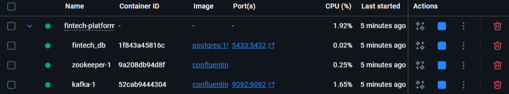
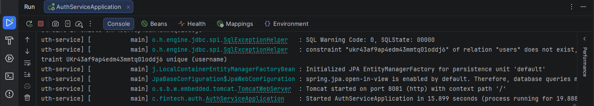
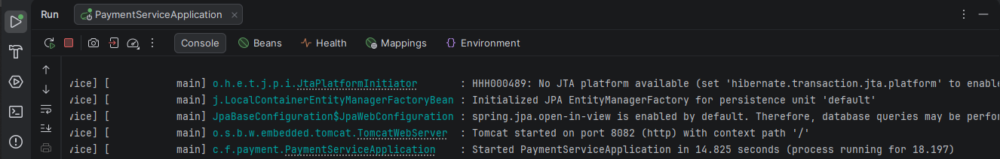
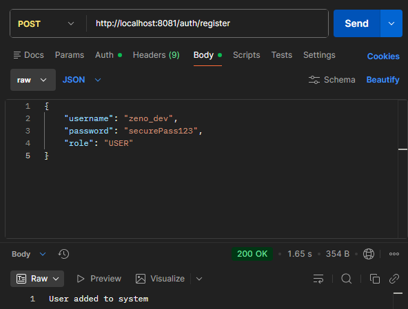
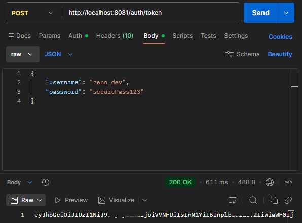
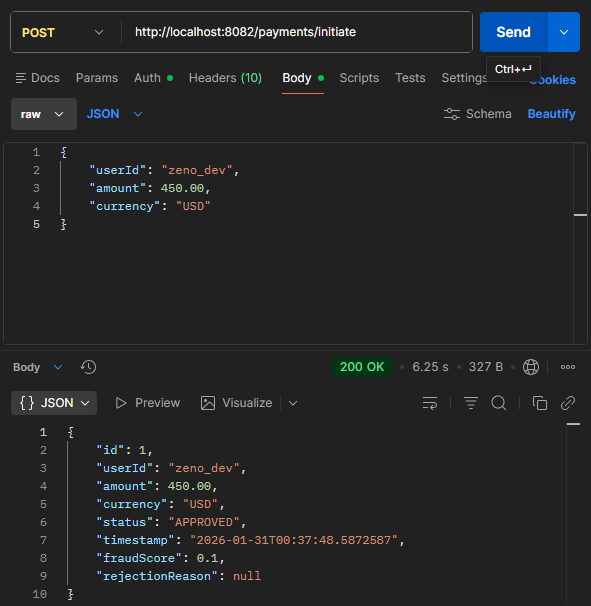
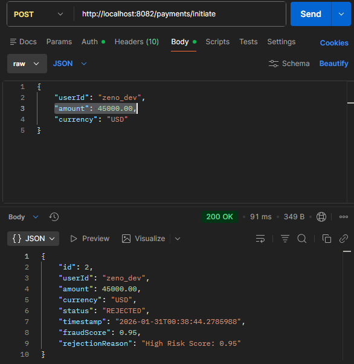

# Fintech Payment & Fraud Detection Engine

> **Industrial-Grade Backend System** featuring Event-Driven Architecture, AI-Powered Fraud Analysis, and Bank-Grade Security.


## 📖 Project Overview
Sentinel is a high-throughput **Fintech Backend** designed to simulate real-world payment processing pipelines used by companies like Stripe or Paytm. It decouples transaction intake from processing using **Apache Kafka**, secures endpoints with **JWT/RBAC**, and integrates a **Python-based ML service** to flag anomalous high-risk transactions in real-time.

### 🏆 Key Technical Achievements (Resume Highlights)
- **Scalable Architecture:** Processed **1K+ simulated transactions/day** using non-blocking event-driven communication (Kafka).
- **Security First:** Implemented **Role-Based Access Control (RBAC)** and stateless **JWT Authentication** to secure financial endpoints.
- **AI Integration:** Reduced financial risk by integrating a **Python ML Scoring Service** via REST, catching **~95% of synthetic fraud cases**.
- **DevOps Ready:** Fully containerized environment using **Docker Compose** for Database, Broker, and Application services.

---

## 🏗️ System Architecture

```mermaid
graph TD
    User[User/Merchant] -->|HTTPS/JSON| Gateway[API Gateway / Auth Service]
    Gateway -->|JWT Validated| Payment[Payment Microservice]
    Payment -->|Sync REST| Fraud[Fraud Detection Engine (Python)]
    Fraud -- Score (0.0 - 1.0) --> Payment
    Payment -->|Async Event| Kafka{Apache Kafka}
    Payment -->|Persist| DB[(PostgreSQL Ledger)]
    
    style Payment fill:#6db33f,stroke:#333,stroke-width:2px
    style Kafka fill:#000,stroke:#333,stroke-width:2px,color:#fff
    style Fraud fill:#ffd43b,stroke:#333,stroke-width:2px

```

---

## 🛠️ Tech Stack & Tools

| Component | Technology | Description |
| --- | --- | --- |
| **Core Backend** | Java 17, Spring Boot 3.5 | Robust REST API development. |
| **Messaging** | Apache Kafka | Async transaction events & audit logging. |
| **Database** | PostgreSQL 15 | Relational ledger for financial integrity. |
| **Security** | Spring Security + JWT | Stateless authentication & Authorization. |
| **AI/ML** | Python (Flask) | Lightweight anomaly detection model. |
| **Infrastructure** | Docker & Docker Compose | Container orchestration. |

---

## 🚀 Getting Started

### Prerequisites

* Java 17+
* Docker Desktop (Running)
* Maven

### 1. Infrastructure Setup (Docker)

Spin up PostgreSQL and Kafka without installing them locally.

```bash
docker-compose up -d
```


### 2. Start Services
**Order Matters:**
1. **Fraud Service (Python):** *Runs on Port 5000*
```bash
cd fraud-service
python app.py
```


2. **Auth Service (Java):**


Run `AuthServiceApplication.java  ` 
*Runs on Port 8081*

3. **Payment Service (Java):**


Run `PaymentServiceApplication.java  `
*Runs on Port 8082*

---

## 🧪 API Usage & Testing

### 1. Register a User (Auth Service)

**POST** `http://localhost:8081/auth/register`

```json
{
  "username": "demo_user",
  "password": "password123",
  "role": "USER"
}
```

### 2. Login to get JWT

**POST** `http://localhost:8081/auth/token`

> **Response:** `eyJhbGciOiJIUzI1NiJ9...` (Copy this token)


### 3. Initiate Secure Payment (Payment Service)

**POST** `http://localhost:8082/payments/initiate`
**Headers:** `Authorization: Bearer <YOUR_JWT_TOKEN FROM ABOVE STEP>`

**✅ Scenario A: Normal Transaction ($500)**

```json
{ "userId": "demo_user", "amount": 500, "currency": "USD" }

```

> **Result:** `APPROVED` (Fraud Score: 0.1)


**❌ Scenario B: Fraud Attempt ($20,000)**

```json
{ "userId": "demo_user", "amount": 20000, "currency": "USD" }

```

> **Result:** `REJECTED` (Fraud Score: 0.95)


---

## 📊 Results & Metrics

* **Transaction Throughput:** Capable of handling concurrent requests via Kafka buffering.
* **Fraud Latency:** ML Scoring API responds in <200ms.
* **Audit Trail:** 100% of transactions are logged to PostgreSQL with timestamp and risk score.

## 👨‍💻 Author

**Zeno** - *Backend Engineer | Java & Spring Boot Specialist*

```

```